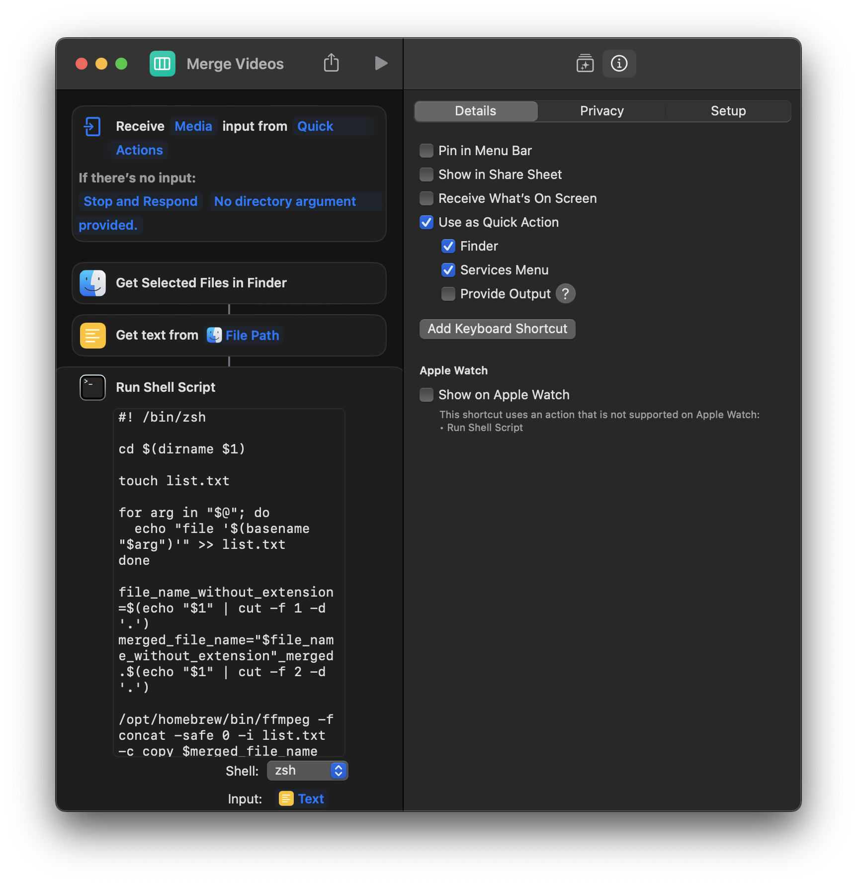

# merge-videos-shortcut
A MacOS shortcut that combines multiple videos into one. For DJI users.

You need to have ffmpeg installed.

```
brew install ffmpeg
```

https://www.icloud.com/shortcuts/bec7b053043c454588b188cf58739776

Don't forget to check *Use as quick action*


